# Taxonomy of Multi-GPU Programming Patterns

This page describes the taxonomy of programming patterns for fine-grained multi-GPU computation and communication overlap, focusing on GEMM + All-Scatter as a representative example.

## Background: Contemporary vs. Iris Approaches

### Bulk Synchronous Programming Model (Contemporary)

The traditional approach, exemplified by frameworks like RCCL, follows a stop-and-go pattern:

<p align="center">
  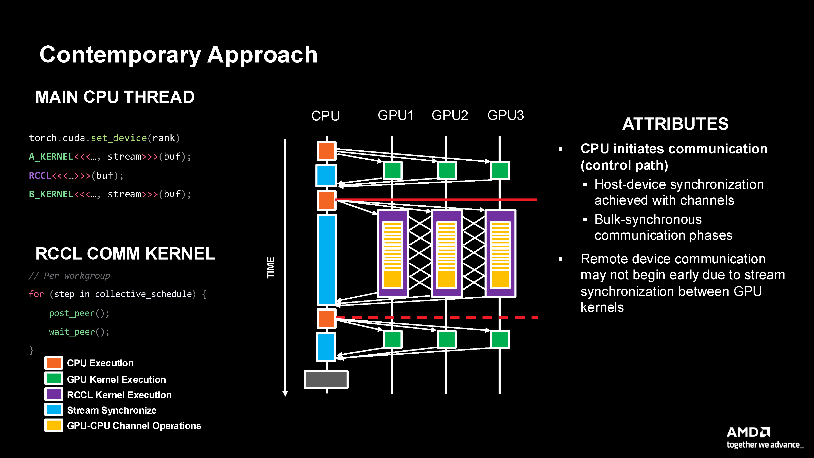
  <br>
  <em>Contemporary approach showing CPU-initiated control with separate compute and RCCL kernels requiring host-device synchronization.</em>
</p>


**Limitations:**
- CPU-initiated control path
- Requires host and device synchronization
- Stop-and-go execution creates inefficiencies
- Cannot achieve fine-grained overlap

### Iris Approach

Iris enables device-side primitives that allow natural work-group-centric programming:

<p align="center">
  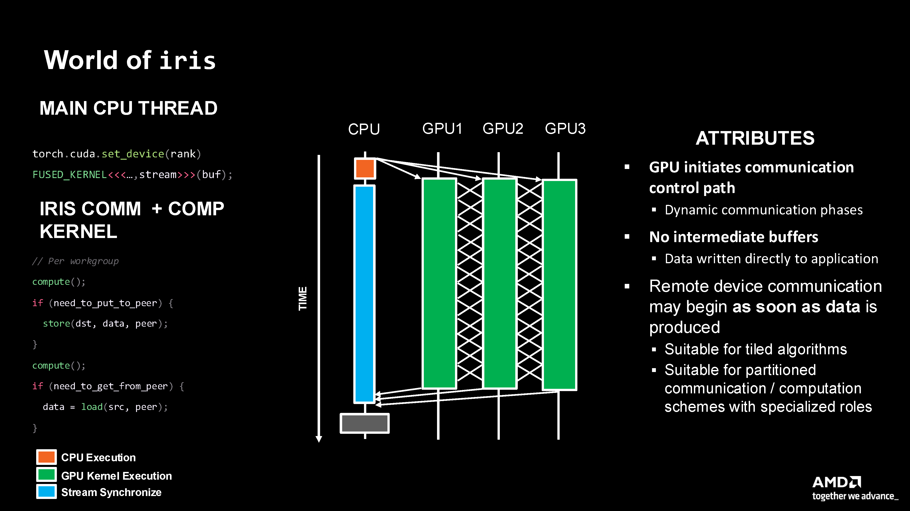
  <br>
  <em>Iris approach with GPU-initiated control where communication begins as soon as data is produced, enabling fine-grained overlap.</em>
</p>

```python
@triton.jit
def kernel(...):
    # Compute at work group granularity
    result = compute(...)
    
    # Store to remote GPU (no intermediate buffers)
    iris.store(buffer + offsets, result, cur_rank, remote_rank, heap_bases)
    
    # Continue with more compute
    # Load from remote GPU
    data = iris.load(buffer + offsets, cur_rank, remote_rank, heap_bases)
```

**Advantages:**
- No intermediate buffers required
- No synchronization overhead between compute and communication
- Remove device communication may begin as soon as the data is produced
- Fine-grained control over resource allocation

## Programming Pattern Taxonomy

The fundamental insight is that **achieving peak performance requires computation-communication overlap**. Iris provides multiple programming patterns to achieve this overlap, each with different trade-offs.

### Pattern Classification

<p align="center">
  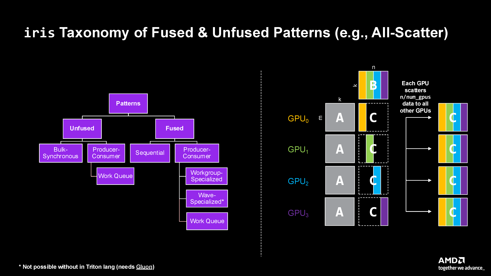
  <br>
  <em>Figure 1: Complete taxonomy of fused and unfused patterns in Iris, illustrated with an All-Scatter example across multiple GPUs.</em>
</p>


## Pattern Details

### 1. Unfused Bulk Synchronous

**Description:** Traditional approach with separate compute and communication kernels, synchronized at the host.

**Example Implementation:** [examples/12_gemm_all_scatter_bulk_synchronous](https://github.com/ROCm/iris/tree/main/examples/12_gemm_all_scatter_bulk_synchronous)

**Characteristics:**
- Two separate kernel launches
- Hard barrier (CPU synchronization) between kernels
- All CUs assigned to compute, then all to communication
- No overlap between computation and communication

<p align="center">
  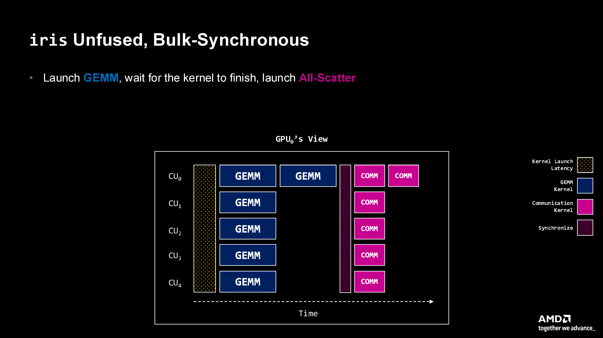
  <br>
  <em>Figure 2: Bulk synchronous execution showing complete separation of compute (GEMM) and communication phases with synchronization barriers.</em>
</p>

**Use Case:** Baseline implementation; matches RCCL-style collectives

**Performance:** Provides slight gains through kernel specialization but lacks overlap benefits

<p align="center">
  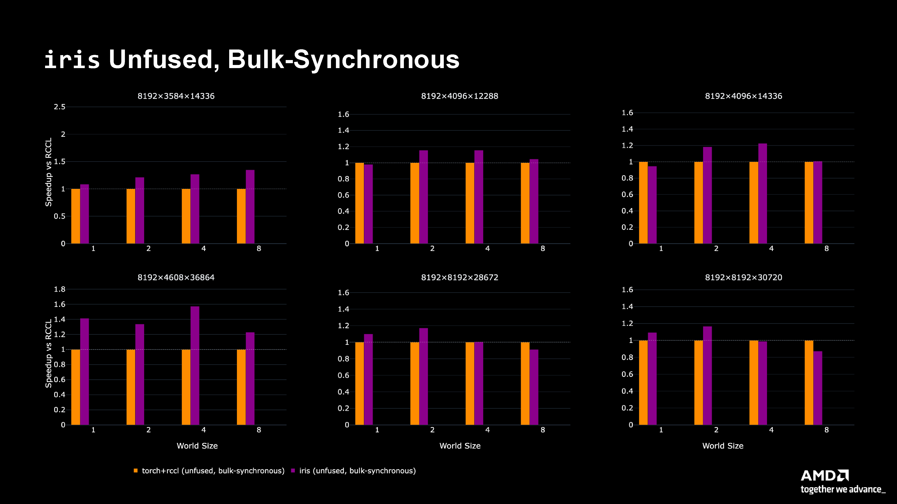
  <br>
  <em>Figure 3: Performance comparison showing bulk synchronous (purple) vs. torch+rccl (orange) across various matrix sizes.</em>
</p>

---

### 2. Unfused Producer-Consumer

**Description:** Separate compute and communication kernels running concurrently with fine-grained synchronization.

**Example Implementation:** [examples/11_gemm_all_scatter_producer_consumer](https://github.com/ROCm/iris/tree/main/examples/11_gemm_all_scatter_producer_consumer)

**Characteristics:**
- Two kernels launched on different streams to establish concurrency
- GPU partitioned between compute CUs and communication CUs
- Producer (compute) releases tiles as they complete
- Consumer (communication) spins waiting for tiles, then consumes them
- Uses atomic operations with acquire/release semantics for synchronization

<p align="center">
  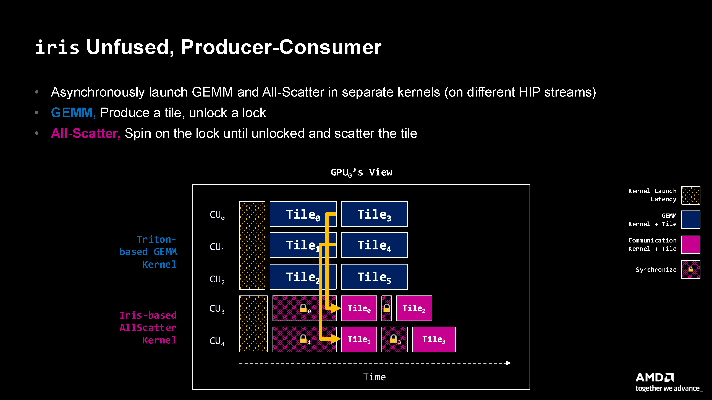
  <br>
  <em>Figure 4: Producer-consumer pattern showing concurrent GEMM (producer) and All-Scatter (consumer) kernels with lock-based synchronization. Note the overlap between tile computation and communication.</em>
</p>

**Implementation Pattern:**
```python
# Producer side
compute_tile(...)
# Release pattern - notify tile is ready
iris.atomic_cas(flag + tile_id, 0, 1, consumer_rank, 
                sem="release", scope="sys")

# Consumer side
# Acquire pattern - wait for tile
done = 0
while done == 0:
    done = iris.atomic_cas(flag + tile_id, 1, 0, consumer_rank,
                          sem="acquire", scope="sys")
# Consume data
data = iris.load(buffer + offsets, consumer_rank, mask=mask)
```

**Key Decision:** GPU partitioning (e.g., 256 CUs for compute, 48 CUs for communication)

**Performance:** Achieves significant speedups (up to 2.5x) through compute-communication overlap

<p align="center">
  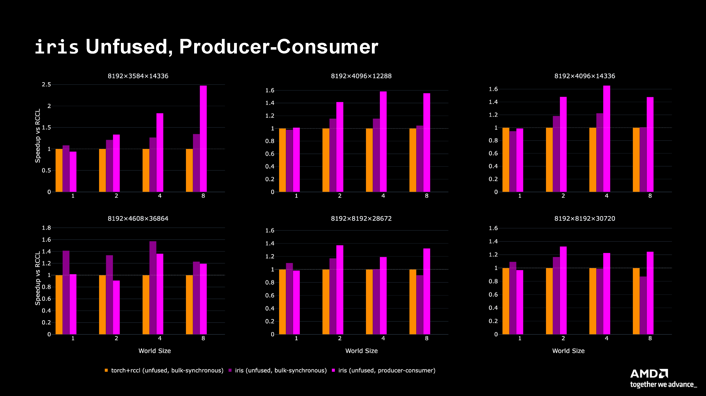
  <br>
  <em>Figure 5: Performance comparison showing producer-consumer (pink) achieving up to 2.5x speedup compared to bulk synchronous approaches.</em>
</p>

---

### 3. Fused Sequential

**Description:** Single über-kernel that computes then communicates sequentially.

**Example Implementation:** [examples/07_gemm_all_scatter](https://github.com/ROCm/iris/tree/main/examples/07_gemm_all_scatter)

**Characteristics:**
- Single kernel launch
- Data stays in registers (no HBM writeback between phases)
- Each work group: compute tile → scatter tile → repeat
- No explicit synchronization needed within work group

<p align="center">
  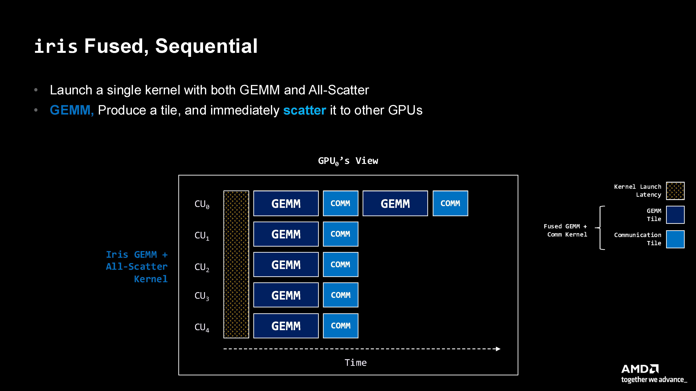
  <br>
  <em>Figure 6: Fused sequential pattern showing GEMM and communication tightly coupled within a single kernel, with data remaining in registers between phases.</em>
</p>

**Advantages:**
- Simplest fused implementation
- Avoids HBM round-trip for intermediate data
- Reduces memory bandwidth pressure

**Disadvantages:**
- Increased register pressure
- Tail effect amplified (idle resources at kernel end)
- No concurrent execution of compute and communication

**Use Case:** Problems where register pressure is manageable and simplicity is valued

<p align="center">
  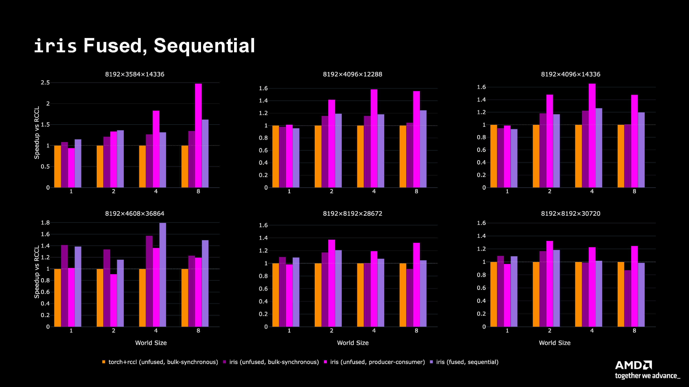
  <br>
  <em>Figure 7: Performance comparison including fused sequential (light purple) showing competitive performance with reduced memory bandwidth usage.</em>
</p>

---

### 4. Fused Producer-Consumer with Work Group Specialization

**Description:** Single kernel where work groups specialize as either producers or consumers at launch.

**Example Implementation:** [examples/10_gemm_all_scatter_wg_specialization](https://github.com/ROCm/iris/tree/main/examples/10_gemm_all_scatter_wg_specialization)

**Characteristics:**
- Single kernel with branching at entry: `if (block_id < num_gem_cus)`
- Producer work groups: compute tiles and release locks
- Consumer work groups: acquire locks and scatter tiles
- Fine-grained synchronization using atomics with GPU scope
- Producer-consumer relationship within a single kernel

<p align="center">
  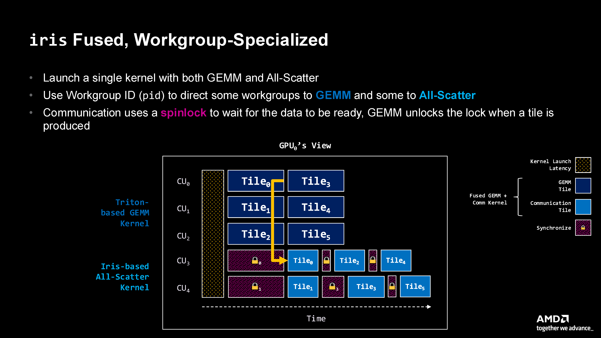
  <br>
  <em>Figure 8: Work group specialization pattern showing a single kernel with work groups specialized as producers (CU₀-CU₂) or consumers (CU₃-CU₄), using spinlocks for fine-grained synchronization.</em>
</p>

**Implementation Pattern:**
```python
@triton.jit
def fused_kernel(...):
    if pid < num_gem_cus:
        # Producer: compute tile
        result = compute_gemm_tile(...)
        store_result(result, ...)
        # Release lock
        iris.atomic_cas(flag, 0, 1, sem="release", scope="gpu")
    else:
        # Consumer: wait and scatter
        while not acquired:
            acquired = iris.atomic_cas(flag, 1, 0, sem="acquire", scope="gpu")
        scatter_tile(...)
```

**Advantages:**
- Better resource utilization (single kernel overhead)
- Potential locality benefits (producer and consumer co-resident)
- No stream synchronization overhead

**Performance:** Achieves strong speedups (up to 2x) for certain problem shapes

<p align="center">
  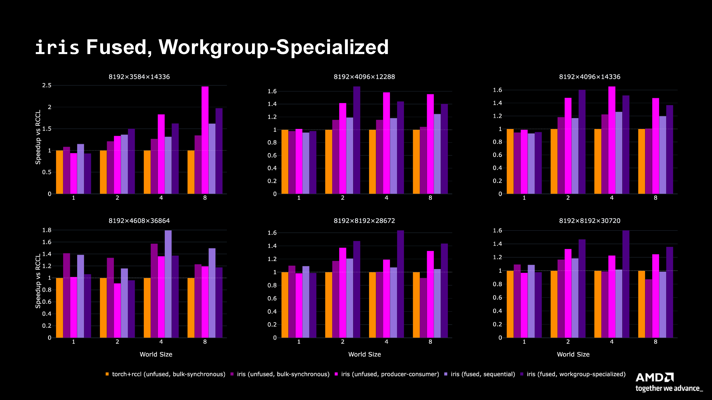
  <br>
  <em>Figure 9: Comprehensive performance comparison showing all patterns. Work group specialization (dark purple) achieves the best performance for most problem sizes, demonstrating up to 60% improvement over producer-consumer patterns.</em>
</p>

---

### 5. Fused Producer-Consumer with Wavefront Specialization

**Description:** Specialization at the wavefront level within work groups (future work).

**Status:** Not yet implementable in standard Triton; requires Gluon

**Potential Benefits:**
- Even finer-grained resource partitioning
- Better cache locality
- Reduced synchronization overhead

---


## Design Philosophy

Iris embraces a core principle: **Provide low-level device APIs that enable rapid exploration of all these patterns.**

Rather than prescribing one "best" approach, Iris empowers developers to:
- Quickly prototype different patterns (examples implemented in ~10 minutes to 1 hour)
- Experiment with GPU partitioning strategies
- Optimize for specific problem characteristics
- Discover novel patterns not yet in this taxonomy

The goal is to make fine-grained multi-GPU programmability a first-class citizen in Triton, maintaining both programmability and performance.

## See Also

- [Programming Model](programming-model.md) - Core concepts and APIs
- [Fine-grained Overlap](finegrained-overlap.md) - Detailed examples of overlap techniques
- [Examples](../reference/examples.md) - Code examples for each pattern

